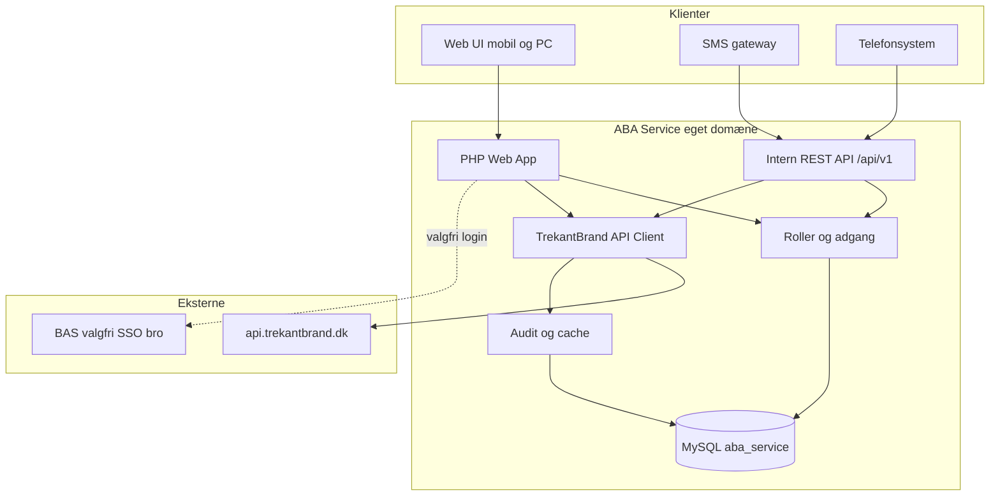
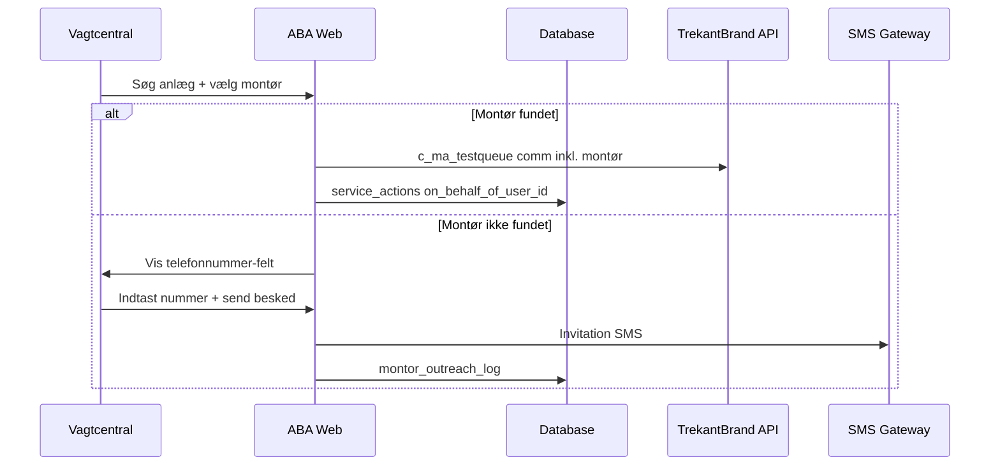
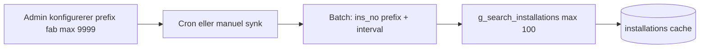
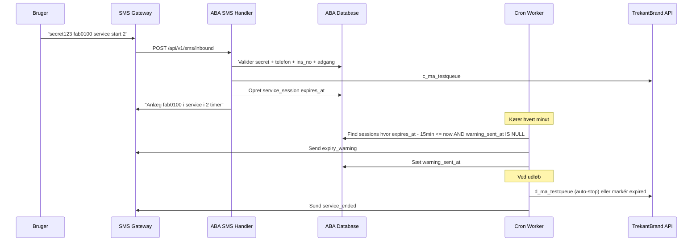

# ABA Service — Arkitekturforslag

> **Stakeholder-version (PDF):** [ABA-Service-Brandvaesen.pdf](ABA-Service-Brandvaesen.pdf) — funktionsbeskrivelse til brandvæsenet med mockups af web og mobil.

## Kontekst

[`c:\Private\aba-service`](c:\Private\aba-service) er et **tomt greenfield-projekt**. Design- og teknisk reference findes i sibling-projektet [`c:\Private\BAS\BAS-1`](c:\Private\BAS\BAS-1) (PHP, MySQL, Tailwind, TrekantBrand-farver).

## TrekantBrand API (verificeret via [APIViewer](https://api.trekantbrand.dk/APIViewer))

**Protokol:**
- Alle kald: `POST https://api.trekantbrand.dk:443/api/v1/{procedure_name}`
- Body: JSON (feltnavne uden `@`, fx `s_ins` ikke `@s_ins`)
- Auth: JWT i header `User-Token: <token>` (hentes via `POST /login/login`)
- `userid` sammenlignes mod TrekantBrand access profile — hver ABA-bruger skal mappes til et TrekantBrand-login

**Kerne-endpoints for ABA Service:**

| Endpoint | Beskrivelse | Vigtige parametre |
|----------|-------------|-------------------|
| `g_search_installations` | Søg anlæg | `userid`, **`miscno2`** (kundenummer/ABA-nr., fx `fab0100`), `ins_no`, `maxrows` |
| `g_installations_by_phone_number` | Find anlæg via telefon (Action Plan) | `phone` (påkrævet), `userid` |
| `g_ma_installations` | Hent anlægsdetaljer | `s_ins`, `deal_id` |
| `c_ma_testqueue` | Sæt anlæg i test/service | `s_ins`, `deal_id`, `test_time` (`DDDD:HH:MM:SS > 0`), `comm`, `zoneix` (-1 = alle zoner) |
| `d_ma_testqueue` | Fjern anlæg fra test/service | `s_ins`, `deal_id`, `term` (påkrævet), `s_inc`, `comment` |
| `g_ma_testqueue` | Status for anlæg i testkø | `s_ins`, `deal_id`, `lines` |
| `g_ma_testqueue_summary` | Overblik over testkø for bruger | `userid`, `s_ins` (0 = alle), `deal_id`, `s_inc` (-1), `scrolldir`, `tstrun`, `noaccess`, `noprofile` — RC 15342 = tom global liste; brug `g_ma_testqueue` per anlæg |
| `c_ma_testqueue_remaining` | Forlæng/justér resterende testtid | `s_ins`, `s_inc` |
| `g_ma_alarmlog` | Læs alarmlog | `s_ins`, `deal_id`, `lines` (antal), `startdate`/`enddate`, `starttime`/`endtime` |
| `c_ma_alarmlog_comment` | Tilføj kommentar til log | `s_ins`, `deal_id`, `s_inc` (0 = log-only), `comm` |

**Log-visning (krav → API-mapping):**
- Sidste 20 hændelser: `g_ma_alarmlog` med `lines: 20`
- Sidste 24 timer: `startdate`/`starttime` + `enddate`/`endtime` beregnet fra nu
- Brugerdefineret periode: samme datofelter med brugerens valg

**Service med/uden tidsbegrænsning:**
- Med tid: `test_time` = `0000:HH:MM:SS` (fx `0000:02:00:00` = 2 timer)
- Uden tidsbegrænsning: API kræver `test_time > 0` — brug lang maksimal værdi (fx `9999:23:59:59`) indtil TrekantBrand bekræfter officiel værdi; verificér i testmiljø

**Vigtige return codes:**
- `c_ma_testqueue`: 15997 = allerede i test, 16026 = ugyldig test_time, 16730 = overlap med pending timer
- `d_ma_testqueue`: 15974 = ikke i test, 16840 = zone restore påkrævet

**Dokumentation:** Ved implementering eksporteres relevante procedure-detaljer fra APIViewer til [`docs/trekantbrand-api.md`](trekantbrand-api.md).

### Verificerede fund (API-test, demo-bruger)

**Login med brugernavn og password alene — ja:**
```
POST https://api.trekantbrand.dk/login/login
Body: { "loginName": "<bruger>", "loginPass": "<password>" }
→ JWT token (levetid ~50.400 sek / 14 timer)
→ Alle efterfølgende kald: header User-Token: <JWT>
→ Uden User-Token: 401 Unauthorized
```

**Hent liste over anlæg — delvist via `g_search_installations`:**
- ReturnCode `0` ved success; resultater filtreres af `userid`s TrekantBrand access profile
- **Hård grænse på 100 rækker per kald** i testmiljø (uanset `maxrows`: 1, 0, 200 osv.)
- Wildcard `%` er **ikke tilladt** i søgefelter (ReturnCode `15999`)
- Filtre som `country`, `city`, `ins_no`, **`miscno2`** virker — kan bruges til at opdele hentning
- **`miscno2` er nøglen til ABA-anlægsnumre** (fx `fab0100` → `miscno2: "fab0100"`, returnerer `ins_no: 001921`, `s_ins: 18381`) — `ins_no`-søgning finder dem ikke nødvendigvis
- Resultatfelter inkl.: `insid`, `deal_id`, `ins_no`, `name`, `city`, `mon_stat`, adresse m.m.
- Dubletter kan forekomme — dedupliker på `insid`/`ins_no` ved cache

**Konsekvens:** Vi kan ikke hente "alle anlæg" i ét kald. Anlægs-cache skal synkroniseres i **batches á max 100** via admin-konfigurerede prefix-intervaller (se nedenfor).

---

## Overordnet arkitektur



**Princip:** ABA Service ejer brugere, adgang og audit. TrekantBrand API udfører den faktiske service-tilstand på anlægget. Alle handlinger logges lokalt uanset om TrekantBrand-kaldet lykkes.

---

## Teknologistack (matcher BAS)

| Lag | Valg | Begrundelse |
|-----|------|-------------|
| Backend | PHP 8.2+ | Samme stack som BAS, kendt driftsmodel |
| Database | MySQL/MariaDB (egen `aba_service`) | Krav om egen database |
| Frontend | Tailwind CSS 3.x + vanilla JS | BAS [`theme.php`](c:\Private\BAS\BAS-1\includes\theme.php) farver: primary `#91191A`, secondary `#caa14a`, bg `#F5F5EF` |
| API-docs | OpenAPI 3.0 + Swagger UI | Samme mønster som [`docs/api/`](c:\Private\BAS\BAS-1\docs\api) |
| Deploy | Eget virtual host/subdomæne (fx `aba.trekantbrand.dk`) | Eget webside og endpoint |

---

## Rollemodel og adgang

| Rolle | Adgang til anlæg | Oprettelse | Typisk bruger |
|-------|------------------|------------|---------------|
| `vagtcentral` | Alle anlæg | Admin / intern | Vagtcentral-operatører |
| `montor` | Alle anlæg | **Selvregistrering** hvis e-mail-domæne tilhører godkendt installatør; ellers admin | Montører / installatører |
| `anlaegsejer` | Kun tildelte anlæg | **Vagtcentral** opretter og tilknytter | Bygningsejere/forvaltere |
| `admin` | Alt + brugerstyring | Første setup | Systemadministrator |

**Adgangskontrol:**
- Vagtcentral og montør: ingen begrænsning på `s_ins` efter login
- Anlægsejer: join mod `user_installations` (mapping via `miscno2` / `s_ins` + `deal_id`)
- Alle TrekantBrand-kald valideres mod brugerens adgang **før** proxy til API
- Vagtcentral kan sætte anlæg i service **på vegne af en montør** — montør identitet logges i audit og `comm` til TrekantBrand

**BAS-integration (valgfri, fase 2):**
- Egen brugerdatabase er primær
- Bro-tabel `bas_user_links` (`bas_username` → `aba_user_id` + rolle)
- BAS menupunkt under Vagtcentral der åbner ABA Service med signeret engangstoken (JWT, 60 sek)
- BAS-brugere logger ind med eksisterende credentials uden at dele BAS-database som primær auth

---

## Brugerstyring og onboarding

### Godkendte installatører (admin)

Admin kan tilføje **godkendte installatører** med tilknyttet **e-mail-domæne** (fx `brandteknik.dk`).

| Felt | Eksempel | Beskrivelse |
|------|----------|-------------|
| Firmanavn | Brand Teknik A/S | Vises i UI og audit |
| E-mail-domæne | `brandteknik.dk` | Uden `@` — matcher suffix på brugerens e-mail |
| Aktiv | ja/nej | Deaktiveret domæne blokerer nye selvregistreringer |

**Når domæne er godkendt:**
- Enhver med e-mail `@brandteknik.dk` kan **selv oprette bruger** via offentlig registreringsside
- Ny bruger tildeles automatisk rolle **`montor`**
- Bruger modtager **sæt-password-link** på e-mail (ingen adgang før password er sat)

**Når domæne IKKE er godkendt:**
- Registrering afvises med tydelig besked, fx:
  > *"Din virksomhed er endnu ikke godkendt til samarbejde med TrekantBrand. Kontakt os for at få godkendt jeres installatør-domæne, før I kan oprette adgang til ABA Service."*
- Eksisterende brugere på ikke-godkendte domæner kan ikke logge ind (hvis domæne senere deaktiveres)

### Password og adgang til konto

Mønster som BAS [`password_flow_token.php`](c:\Private\BAS\BAS-1\includes\password_flow_token.php):

| Flow | Udløser | Handling |
|------|---------|----------|
| **Sæt password** | Bruger oprettet (admin, VC eller selvregistrering) | E-mail med engangstoken-link til `/set-password?token=…` |
| **Glemt password** | Bruger klikker "Anmod om nyt password" | E-mail med reset-link (samme token-mekanisme, kort levetid) |
| **Adgangsbekræftelse** | Hver 3. måned (konfigurerbart) | Bruger skal bekræfte at de fortsat ønsker adgang — ellers suspenderes konto |

**Adgangsbekræftelse (periodisk):**
- Standard-interval: **3 måneder** (`system_settings.access_confirm_months`)
- Admin kan hæve/sænke interval globalt
- Ved login: hvis `access_confirm_due_at` er passeret → redirect til bekræftelsesside
- Efter bekræftelse: `access_confirmed_at` opdateres, næste forfald beregnes
- Ved manglende bekræftelse efter grace-periode: `active = 0` + e-mail-påmindelse

### Vagtcentral — anlægsbrugere

Vagtcentral kan:

1. **Oprette ny anlægsbruger** (`anlaegsejer`) + tilknytte **nyt anlæg** (miscno2 fra cache/søgning)
2. **Tilknytte nyt anlæg** til **eksisterende anlægsbruger**
3. Sende **sæt-password-link** til anlægsbrugerens e-mail ved oprettelse

Workflow: søg/find anlæg → opret eller vælg bruger → tilknyt `user_installations` → send velkomst/e-mail.

### Vagtcentral — service på vegne af montør

Vagtcentral skal **hurtigt** kunne sætte anlæg i service. UI-prioritet:

1. **Søg anlæg** (miscno2, adresse) — stor søgefelt øverst
2. **Vælg montør** — autocomplete/søgning blandt registrerede montører
3. **Varighed** — hurtigvalg (1t / 2t / 3t / 4t / 24t / ubegrænset)
4. **Bekræft** — service sættes med `comm` der inkluderer montørnavn + VC-operatør

**Montør findes ikke:**
- Vis ekstra felt **telefonnummer**
- VC kan sende **SMS-besked** til personen (invitation til at registrere sig / kontakt montørfirma)
- Log i `montor_outreach_log` (telefon, besked, afsender-VC, tidspunkt)
- Service kan stadig sættes uden montør-tilknytning, men audit markerer `on_behalf_of_user_id = NULL` + note



---

## Database-skema (kernen)

```sql
-- Systemindstillinger
system_settings (key, value, updated_at)
  -- access_confirm_months: 3 (default) — admin kan ændre
  -- password_reset_token_ttl_hours: 24

-- Godkendte installatører (e-mail-domæner for montør-selvregistrering)
approved_installers (
  id, company_name, email_domain, active, approved_at, approved_by_user_id, created_at
)
  -- email_domain: fx "brandteknik.dk" (lowercase, uden @)

-- Brugere og roller
users (
  id, email, username, password_hash, role, phone,
  trekant_userid, sms_secret_hash,
  installer_id,          -- FK approved_installers (montører fra selvregistrering)
  active,
  password_set_at, access_confirmed_at, access_confirm_due_at,
  created_at, created_by_user_id
)
bas_user_links (aba_user_id, bas_username)  -- valgfri BAS SSO-bro

-- Password / velkomst tokens (opaque, single-use)
password_flow_tokens (
  id, user_id, token_hash, kind, expires_at, used_at, created_at
)
  -- kind: welcome | reset | vc_invite

-- Anlæg (cache/synk fra g_search_installations)
installations (id, s_ins, deal_id, ins_no, miscno2, name, address, mon_stat, last_synced_at)
  -- ins_no: internt anlægsnummer i TrekantBrand (fx "001921")
  -- miscno2: ABA/kundenummer (fx "FAB0100") — **primær nøgle for SMS og brugersøgning**

-- Admin: prefix-regler til batch-synk af anlæg (100 pr. API-kald)
sync_prefixes (
  id, prefix, max_suffix, batch_size, active, last_sync_at, last_sync_count, created_at
)
  -- prefix: fx "fab" — søges via g_search_installations.**miscno2** (ikke ins_no)
  -- max_suffix: øvre grænse for nummerdelen (fx 9999 → dækker fab0001..fab9999)
  -- batch_size: max rækker per kald (default 100, matcher API-grænse)
  -- Systemet itererer prefix+suffix-intervaller og kalder API for hvert batch

-- Log over synkroniseringskørsler
installation_sync_runs (
  id, sync_prefix_id, started_at, finished_at, batches_requested, rows_received, rows_upserted, status, error_message
)

-- Anlægsejer-tilknytning
user_installations (user_id, installation_id)

-- Aktive service-sessioner (styring af SMS-påmindelser)
service_sessions (
  id, user_id, installation_id, s_inc,
  started_at, expires_at, duration_hours, unlimited,
  warning_sent_at, ended_at, status, source
)
  -- status: active | ended | expired
  -- warning_sent_at: sættes når 15-min SMS er sendt

-- Service-handlinger (lokal audit)
service_actions (
  id, user_id, on_behalf_of_user_id, session_id,
  s_ins, deal_id, action, test_time, comm, source, created_at
)
  -- user_id: hvem udførte (VC-operatør ved on-behalf)
  -- on_behalf_of_user_id: montør service sættes på vegne af (nullable)
  -- action: start_service | stop_service | extend_service | add_comment
  -- source: web | sms | api | bas_sso | cron

-- VC: kontakt montør der ikke findes i systemet
montor_outreach_log (
  id, vc_user_id, phone, message, miscno2, installation_id, sms_outbound_id, created_at
)

-- API-nøgler til telefonsystemer
api_tokens (id, name, token_hash, role, allowed_ips, active)

-- SMS-log
sms_inbound_log (id, from_number, body, parsed_command, user_id, result, created_at)
sms_outbound_log (id, to_number, body, trigger, session_id, status, created_at)
  -- trigger: service_started | service_ended | expiry_warning | error_reply | help
```

Anlægsdata synkroniseres via admin-konfigurerede **sync-prefixes** og caches lokalt. Dashboard og SMS slår op i lokal cache — ikke direkte mod TrekantBrand ved hvert søg.

---

## Anlægssynkronisering (admin-modul)

Fordi `g_search_installations` max returnerer **100 rækker per kald**, konfigurerer admin et sæt prefix-regler. Systemet synkroniserer anlæg i batches.

### Admin-UI: Sync-prefixes

| Felt | Eksempel | Beskrivelse |
|------|----------|-------------|
| Prefix | `fab` | Start af `miscno2` — søges mod TrekantBrand |
| Max | `9999` | Øvre grænse for suffix-delen (numerisk/alfanumerisk efter prefix) |
| Batch-størrelse | `100` | Max rækker per API-kald (default 100) |
| Aktiv | ja/nej | Om prefix inkluderes i planlagt synk |

**Eksempel:** Prefix `fab`, max `9999` → systemet genererer søgninger som `ins_no=fab0001`, `fab0002`, … eller opdeler i interval-batches indtil max, med max 100 resultater per kald.

### Synk-flow



1. Admin opretter/redigerer prefix-regler
2. Manuel "Synk nu" eller planlagt cron (fx natligt)
3. For hvert aktivt prefix: iterér suffix-intervaller i batches á 100
4. Kald `g_search_installations` med `userid` (service-konto) + `miscno2`-filter (prefix-baseret)
5. Upsert til `installations` (dedupliker på `s_ins` + `deal_id`)
6. Log resultat i `installation_sync_runs`

**Manuel synk:** Admin kan trigge synk for ét prefix eller alle aktive.

**Fejlhåndtering:** Hvis et batch returnerer præcis 100 rækker, log advarsel — intervallet skal muligvis opdeles finere (TrekantBrand kan have flere end 100 med samme prefix-start).

---

## TrekantBrand API-klient

Central PHP-klient i `includes/trekant_client.php`:

```php
// Autentificering: JWT fra .env (service-konto) eller brugerens trekant_userid
trekant_login(string $username, string $password): string  // returnerer JWT
trekant_post(string $endpoint, array $payload, ?string $userToken = null): array

// Anlæg
trekant_search_installations(array $filters): array
trekant_sync_installations_by_prefix(string $prefix, int $maxSuffix, int $batchSize = 100): SyncResult
trekant_installations_by_phone(string $phone): array
trekant_get_installation(int $s_ins, string $deal_id): array

// Service/testkø
trekant_start_service(int $s_ins, string $deal_id, string $test_time, ?string $comment): array
trekant_stop_service(int $s_ins, string $deal_id, string $term, ?string $comment): array
trekant_get_service_status(int $s_ins, string $deal_id): array

// Log
trekant_get_alarmlog(int $s_ins, string $deal_id, array $filters): array
trekant_add_comment(int $s_ins, string $deal_id, int $s_inc, string $comment): array
```

**Auth-flow:**
1. ABA Service logger ind mod TrekantBrand med service-konto (`.env`: `TREKANT_API_USER`, `TREKANT_API_PASS`)
2. JWT caches i memory/Redis med TTL (50400 sek ifølge API)
3. Hvert kald sender `User-Token` header + `userid` i body (brugerens `trekant_userid`)
4. TrekantBrand access profile på `userid` styrer hvilke anlæg API tillader — suppleret af ABA's egen rollemodel

**Service med/uden tidsbegrænsning:**
- Med tid: `test_time` = `0000:HH:MM:SS`
- Ubegrænset: `9999:23:59:59` (verificér i testmiljø)
- `comm`-felt bruges til at logge hvem der satte anlæg i service (fx "ABA Service: bruger X via web")

---

## Web UI (BAS-lignende, responsiv)

**Sider:**

1. **Login** — e-mail + password; link til "Glemt password"; redirect til adgangsbekræftelse hvis forfaldet
2. **Registrering (montør)** — e-mail → tjek godkendt domæne → opret bruger → send sæt-password-link
3. **Sæt password / Nulstil password** — token-baseret (som BAS)
4. **Adgangsbekræftelse** — "Bekræft at du fortsat ønsker adgang til ABA Service"
5. **Dashboard** — rolleafhængig; VC: hurtig søgning + "sæt i service"
6. **Anlægsdetalje** — nøgleinfo, service-status, handlinger, log
7. **VC: Service-flow** — søg anlæg → vælg montør (eller telefon-invitation) → varighed → start
8. **VC: Anlægsbrugere** — opret bruger, tilknyt anlæg, send velkomst-mail
9. **Log-visning** — Sidste 20 | 24 timer | Brugerdefineret periode
10. **Admin**:
    - Godkendte installatører (domæner)
    - Brugere, anlægstildelinger, API-nøgler
    - Sync-prefixes + batch-synk
    - Systemindstillinger (adgangsbekræftelse-interval m.m.)
    - SMS-hemmelighed per bruger

**Responsivt design:**
- Desktop: tabel-layout med gyldne header-rækker (BAS-stil)
- Mobil: kort-baseret liste, store touch-knapper, sticky handlingsbar
- `viewport` meta + Tailwind breakpoints (`sm`, `md`, `lg`)

**Layout-struktur** (som BAS [`layout.php`](c:\Private\BAS\BAS-1\layout.php)):
- Topbar med bruger/rolle
- Simpel navigation (Dashboard, Admin)
- Ingen tung sidebar på mobil

---

## Intern REST API (til telefonsystemer)

Base: `POST/GET /api/v1/` med Bearer-token auth (mønster fra BAS [`rest-api.md`](c:\Private\BAS\BAS-1\docs\api\rest-api.md)).

| Metode | Endpoint | Formål |
|--------|----------|--------|
| `GET` | `/api/v1/installations` | List/søg anlæg (rollefiltreret) |
| `GET` | `/api/v1/installations/{s_ins}` | Anlægsdetalje + service-status |
| `POST` | `/api/v1/installations/{s_ins}/service` | Start service (`duration` eller `unlimited`) |
| `DELETE` | `/api/v1/installations/{s_ins}/service` | Stop service |
| `GET` | `/api/v1/installations/{s_ins}/log` | Hent log (`limit`, `from`, `to`) |
| `POST` | `/api/v1/installations/{s_ins}/comments` | Tilføj kommentar |
| `POST` | `/api/v1/sms/inbound` | Webhook fra SMS-gateway |

Alle svar: JSON med `status`, `data`, `error`. OpenAPI-spec i `docs/api/aba-service.openapi.yaml`.

---

## SMS-flow (egen brugerdatabase)

SMS valideres **primært mod ABA's egen brugerdatabase** — ikke TrekantBrand telefonopslag. Brugeren identificeres via sit personlige SMS-hemmelighed + registrerede telefonnummer.

### Kommandosyntax

```
<secret> <anlægsnr> service start [timer]
<secret> <anlægsnr> service stop
<secret> <anlægsnr> status
HJÆLP
```

**Eksempler:**
- `secret123 fab0100 service start` — start service (standard 1 time)
- `secret123 fab0100 service start 2` — start service i 2 timer
- `secret123 fab0100 service stop` — afslut service
- `secret123 fab0100 status` — nuværende status

Felt-mapping:
- `<secret>` → `users.sms_secret_hash` (verificér med `password_verify`)
- `<anlægsnr>` → `installations.miscno2` (fx `fab0100`, case-insensitive) — søges mod TrekantBrand via `miscno2`, caches med `ins_no` + `s_ins`
- Afsendernummer → `users.phone` (skal matche — afvis hvis ukendt/afvigende)

### Inbound-validering (rækkefølge)

1. Parse SMS-tekst (case-insensitive, fleksible mellemrum)
2. Find bruger via `sms_secret` — fejl → SMS: "Ugyldig kode"
3. Tjek afsendernummer = `users.phone` — fejl → SMS: "Telefonnummer ikke registreret"
4. Find anlæg via `miscno2` (lokal cache eller live opslag med `g_search_installations`) — fejl → SMS: "Anlæg ikke fundet"
5. Tjek rolle/adgang (`user_installations` eller vagtcentral/montør) — fejl → SMS: "Ingen adgang"
6. Udfør kommando mod TrekantBrand API
7. Send bekræftelses-SMS (se nedenfor)

### Outbound-beskeder (automatiske)

| Trigger | Tidspunkt | Besked (eksempel) |
|---------|-----------|-------------------|
| `service_started` | Straks efter start | "Anlæg fab0100 er sat i service i 2 timer. Udløber kl. 14:30." |
| `expiry_warning` | 15 min før udløb | "Anlæg fab0100 udløber om 15 min. Send ny 'service start [timer]' for at forlænge." |
| `service_ended` | Ved stop eller udløb | "Anlæg fab0100 er taget ud af service." |
| `service_extended` | Ved ny start mens aktiv | "Anlæg fab0100 forlænget med 2 timer. Ny udløb kl. 16:30." |
| `error_reply` | Ved fejl | Kort fejlbesked på dansk |

### Forlængelse via SMS

Når bruger sender `service start [timer]` mens anlægget allerede er i service:
1. Kald `c_ma_testqueue_remaining` eller ny `c_ma_testqueue` med opdateret `test_time`
2. Opdatér `service_sessions.expires_at` og nulstil `warning_sent_at`
3. Send `service_extended`-SMS
4. Planlæg ny 15-min påmindelse

### Scheduler (cron-worker)

`scripts/cron_service_notifications.php` kører hvert minut (Windows Task Scheduler / cron):



**Cron-opgaver:**
- Send `expiry_warning` 15 min før `expires_at` (kun én gang per session)
- Ved `expires_at`: auto-stop via `d_ma_testqueue` + send `service_ended` (medmindre ubegrænset)
- Genplanlæg `warning_sent_at` ved forlængelse

### SMS-gateway integration

- Inbound: webhook `POST /api/v1/sms/inbound` fra SMS-gateway (fx Inmobile, som BAS bruger)
- Outbound: genbrug BAS SMS V2-mønster (`/Api/V2/Sms/sendSms.php`) eller direkte Inmobile API
- Admin kan regenerere `sms_secret` per bruger i admin-UI

---

## Projektstruktur

```
aba-service/
  public/                  # Document root
    index.php
    login.php
    api/v1/                # REST endpoints
  includes/
    db.php
    auth.php
    password_flow.php
    access_confirm.php
    installer_domains.php
    trekant_client.php
    sms_parser.php
    sms_sender.php
    service_session.php
    installation_sync.php
    roles.php
    theme.php              # BAS TrekantBrand palette
  scripts/
    cron_service_notifications.php   # 15-min advarsler + auto-stop ved udløb
    cron_installation_sync.php       # Planlagt batch-synk af anlæg
    cron_access_confirm_reminders.php  # Påmindelse om adgangsbekræftelse
  pages/
    dashboard.php
    installation.php
    register.php                     # Montør selvregistrering
    set_password.php
    forgot_password.php
    access_confirm.php
    vc_service.php                   # VC: hurtig service + montør-valg
    vc_anlaegsbrugere.php            # VC: opret/tilknyt anlægsbruger
    admin_users.php
    admin_installers.php             # Godkendte installatører/domæner
    admin_sync_prefixes.php
    admin_settings.php
  partials/
    header.php
    footer.php
  Database/
    schema.sql
    migrations/
  docs/
    PLAN.md
    trekantbrand-api.md
    api/aba-service.openapi.yaml
  assets/css/app.css       # Tailwind build
  tailwind.config.js
  composer.json
  .env.example
```

---

## Implementeringsfaser

### Fase 1 — Fundament (MVP web)
- Projekt-scaffold, database, auth med roller
- TrekantBrand-klient + admin sync-prefixes + anlægs-cache
- Login, password-set/reset-links, adgangsbekræftelse (3 md.)
- Admin: godkendte installatører (domæner)
- Montør selvregistrering via godkendt domæne
- Dashboard + anlægsdetalje + sæt/fjern service
- **VC service-flow** med montør-søgning og on-behalf audit

### Fase 2 — Log, VC anlægsbrugere og API
- Alarmlog-læsning + log-UI
- **VC: opret anlægsbruger** + tilknyt anlæg (ny/eksisterende)
- **VC: montør-invitation via SMS** når montør ikke findes
- Intern REST API + OpenAPI

### Fase 3 — SMS, notifikationer og BAS-bro
- SMS inbound/outbound + cron notifikationer
- E-mail: velkomst, password-reset, adgangsbekræftelse-påmindelse
- Valgfri BAS SSO-bro

### Fase 4 — Hærdning
- IP-whitelist, rate limiting
- Finjustering batch-synk + planlagt cron
- Admin finjustering af adgangsbekræftelse-interval

---

## Sikkerhed

- Password hashing: `password_hash()` (bcrypt/argon2)
- Password/velkomst-tokens: opaque, hashed i DB, single-use, kort TTL
- E-mail-domæne validering ved montør-registrering mod `approved_installers`
- Periodisk adgangsbekræftelse (default 3 md., admin-konfigurerbart)
- CSRF på web-forms
- API: Bearer tokens med hash i DB, valgfri IP-whitelist
- Alle TrekantBrand-kald gated af rolle/adgang
- `on_behalf_of_user_id` i audit — sporbarhed når VC handler for montør
- HTTPS only
- Ingen secrets i git — `.env` for DB, TrekantBrand-credentials, SMS/e-mail

---

## Afhængigheder og risici

| Punkt | Status | Handling |
|-------|--------|----------|
| Alarmlog-læsning | Løst: `g_ma_alarmlog` | Map `lines`, datofelter til UI-filtre |
| Service-status | Løst: `g_ma_testqueue` | Vis aktiv test + resterende tid |
| `test_time` ubegrænset | Delvist | Brug `9999:23:59:59` — verificér i testmiljø |
| `d_ma_testqueue` kræver `term` | Kendt | Gem `term` per bruger/session (fx `ABA` + bruger-id) |
| TrekantBrand `userid` access | Kendt | Hver bruger skal have `trekant_userid` med korrekt access profile |
| SMS anlægsopslag | Egen DB via `ins_no` | `g_installations_by_phone_number` kun som supplement |
| SMS notifikationer | Specificeret | Cron + `service_sessions` for 15-min advarsel og auto-stop |
| SMS-gateway | Ikke specificeret | Genbrug Inmobile/integration fra BAS-miljø |
| Produktions-credentials | Mangler | Demo `nki`/`Test1234` kun til udvikling — egne credentials til drift |
| API 100-rækkers grænse | Verificeret | Admin sync-prefixes + batch-synk; advarsel hvis batch returnerer præcis 100 |
| TrekantBrand login | Verificeret | Brugernavn/password → JWT; `User-Token` på alle API-kald |
| Montør onboarding | Specificeret | Godkendt domæne → selvregistrering; ellers afvisningsbesked |
| Adgangsbekræftelse | Specificeret | Default 3 md.; admin kan justere; cron-påmindelse |
| E-mail-afsendelse | Ikke specificeret | PHPMailer/SMTP som BAS; velkomst + reset + bekræftelse |

---

## Næste skridt efter godkendelse

1. Godkend planen
2. Scaffold projektet med PHP/Tailwind/Composer
3. Eksporter API-detaljer fra [APIViewer](https://api.trekantbrand.dk/APIViewer) til `docs/trekantbrand-api.md`
4. Opret databaseskema og `.env.example` (inkl. `TREKANT_API_USER`, `TREKANT_API_PASS`)
5. Implementer fase 1 (web MVP med TrekantBrand-integration)
