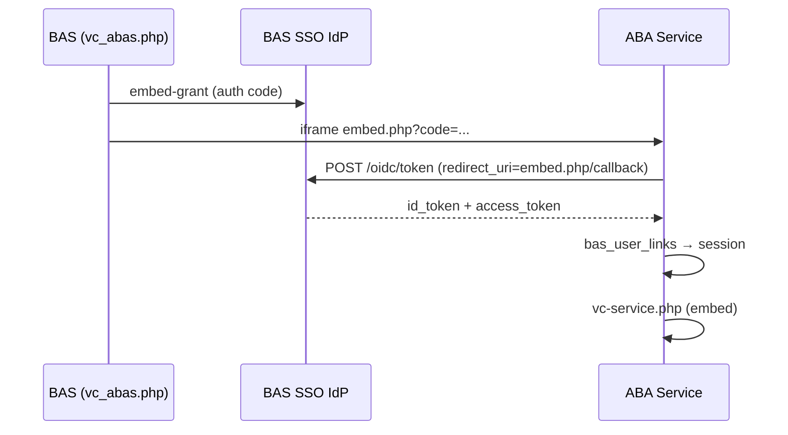

# BAS SSO og VC Service-embed

ABA Service integrerer med **BAS OIDC IdP** som relying party (OIDC-klient). Vagtcentralen åbner VC Service inde i BAS via iframe (`pages/vc_abas.php`).

## Arkitektur



## Konfiguration i ABA Service (`env.local`)

| Variabel | Beskrivelse |
|----------|-------------|
| `BAS_SSO_ENABLED` | `1` / `0` |
| `BAS_SSO_ISSUER` | Fx `https://test2.beredskabsalarmering.dk/sso` |
| `BAS_SSO_CLIENT_ID` | Fx `abas-web` — skal matche OIDC-klient i BAS |
| `BAS_SSO_CLIENT_SECRET` | Hemmelighed fra BAS SSO-klientadmin |
| `BAS_SSO_EMBED_URL` | Valgfri fuld URL til `embed.php` (default: `APP_URL` + `/embed.php`) |
| `BAS_SSO_REDIRECT_URI` | Valgfri callback for «Log ind via BAS» (default: `/sso/callback.php`) |
| `BAS_SSO_AUTO_LINK_EMAIL` | `1` = knyt automatisk via e-mail hvis link mangler |
| `BAS_SSO_TRUST_MFA` | `1` = spring MFA over ved SSO-login |

## Konfiguration i BAS

I BAS miljøvariabler (se `includes/include.php`):

- `BAS_ABAS_EMBED_URL` — skal pege på ABA `embed.php` (fx `https://teknikweb2.trekantbrand.dk/embed.php`)
- `BAS_ABAS_CLIENT_ID` — samme som `BAS_SSO_CLIENT_ID` i ABAS

OIDC-klient i BAS (`sso_oidc_clients`) skal have:

- **client_id:** `abas-web` (eller miljøspecifik variant)
- **redirect_uris:** `{BAS_ABAS_EMBED_URL uden query}/callback` — fx `https://teknikweb2.trekantbrand.dk/embed.php/callback`
- **required_permission_ids:** `[60]` (ABA Service-menu i vagtcentral)
- **require_pkce:** kan være `0` for embed-grant (BAS udsteder kode uden PKCE)

## Brugerkobling (`bas_user_links`)

SSO mapper BAS-brugeren til ABA via tabellen `bas_user_links`:

```sql
INSERT INTO bas_user_links (aba_user_id, bas_username)
VALUES (1, 'pfr');
-- bas_username = BAS users.username (preferred_username i id_token)
```

Alternativt: hvis `BAS_SSO_AUTO_LINK_EMAIL=1` og e-mail matcher en aktiv ABA-bruger, oprettes linket automatisk ved første login.

ABA-brugeren skal have rolle `vagtcentral` eller `admin` for VC Service-embed.

## Endpoints i ABA Service

| Fil | Formål |
|-----|--------|
| `public/embed.php` | Modtager `?code=` fra BAS iframe, logger ind, viser VC Service |
| `public/sso/login.php` | Starter OIDC-flow (PKCE) |
| `public/sso/callback.php` | Callback for «Log ind via BAS» på login-siden |
| `public/vc-service.php?embed=1` | VC Service uden header — til iframe |

## Test

1. Opret OIDC-klient og `bas_user_links` i ABAS.
2. Sæt env i begge systemer.
3. Log ind i BAS som bruger med permission 60.
4. Åbn **Vagtcentral → ABA Service** — VC Service skal loades i iframe.
5. Valgfrit: «Log ind via BAS» på ABAS login-siden.
