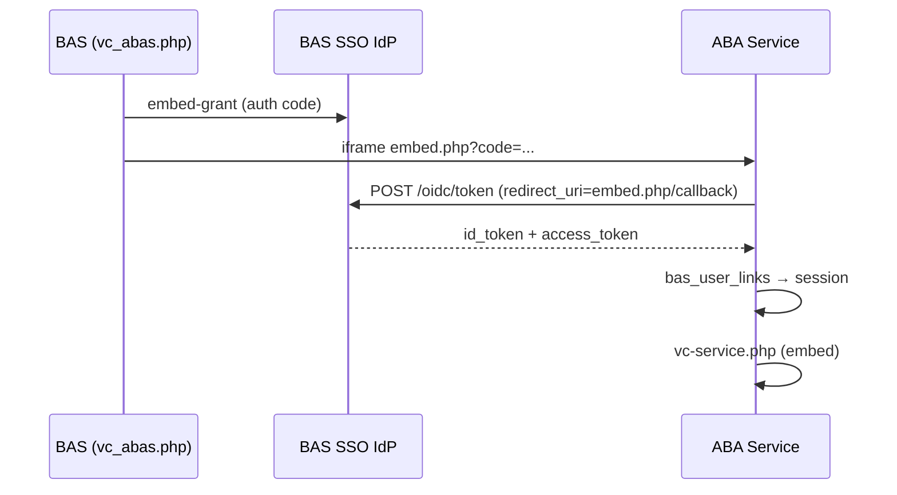

# BAS SSO og VC Service-embed

ABA Service integrerer med **BAS OIDC IdP** som relying party (OIDC-klient). Vagtcentralen åbner VC Service inde i BAS via iframe (`pages/vc_abas.php`).

## Arkitektur



## Konfiguration i ABA Service (`env.local`)

| Variabel | Beskrivelse |
|----------|-------------|
| `BAS_SSO_ENABLED` | `1` / `0` |
| `BAS_SSO_ISSUER` | Fx `https://test2.beredskabsalarmering.dk/sso` |
| `BAS_SSO_CLIENT_ID` | Fx `abas-web` — skal matche OIDC-klient i BAS |
| `BAS_SSO_CLIENT_SECRET` | Hemmelighed fra BAS SSO-klientadmin |
| `BAS_SSO_EMBED_URL` | Valgfri fuld URL til `embed.php` (default: `APP_URL` + `/embed.php`) |
| `BAS_SSO_REDIRECT_URI` | Valgfri callback for «Log ind via BAS» (default: `/sso/callback.php`) |
| `BAS_SSO_AUTO_LINK_EMAIL` | `1` = knyt automatisk via e-mail hvis link mangler |
| `BAS_SSO_TRUST_MFA` | `1` = spring MFA over ved SSO-login |

## Konfiguration i BAS

I BAS miljøvariabler (se `includes/include.php`):

- `BAS_ABAS_EMBED_URL` — skal pege på ABA `embed.php` (fx `https://teknikweb2.trekantbrand.dk/embed.php`)
- `BAS_ABAS_CLIENT_ID` — samme som `BAS_SSO_CLIENT_ID` i ABAS

OIDC-klient i BAS (`sso_oidc_clients`) skal have:

- **client_id:** `abas-web` (eller miljøspecifik variant)
- **redirect_uris:** begge skal være registreret:
  - `https://teknikweb2.trekantbrand.dk/embed.php/callback` (VC iframe)
  - `https://teknikweb2.trekantbrand.dk/sso/callback.php` («Log ind via BAS»)
- **required_permission_ids:** `[60]` (ABA Service-menu i vagtcentral)
- **require_pkce:** kan være `0` for embed-grant (BAS udsteder kode uden PKCE)

## SCIM-provisionering fra BAS

BAS kan **auto-oprette/opdatere** ABA-brugere via outbound SCIM push — kun for brugere der består klientens permission-gate (fx permission **60**).

### ABAS (`env.local`)

```env
SCIM_BEARER_TOKEN=<lang tilfældig hemmelighed — samme værdi som i BAS klient>
```

Endpoint: `https://<abas-host>/scim/v2/Users`  
Migration: `Database/migrations/010_scim_bas_links.sql`

### BAS (SSO-klient `abas-web`)

| Felt | Værdi |
|------|--------|
| SCIM push | ✅ |
| SCIM auto-provision | ✅ |
| SCIM base URL | `https://teknikweb2.trekantbrand.dk/scim/v2` |
| SCIM bearer token | Samme som `SCIM_BEARER_TOKEN` i ABAS |
| Krævede permission IDs | `60` |

Ved oprettelse/opdatering af en BAS-bruger med permission 60 pushes brugeren til ABAS. ABAS opretter:

- `users`-række (rolle `vagtcentral`, ingen adgangskode — kun SSO)
- `bas_user_links` med `bas_username`, `bas_oidc_sub`, `scim_id`

Ved sletning/deaktivering i BAS deaktiveres ABA-brugeren (`active = 0`).

---

## Brugerkobling (`bas_user_links`)

SSO og SCIM mapper BAS-brugeren til ABA via tabellen `bas_user_links` (`bas_username`, `bas_oidc_sub`, `scim_id`).

- **SCIM** opretter koblingen automatisk for brugere med permission 60.
- **Første SSO-login** kan auto-linke via e-mail (`BAS_SSO_AUTO_LINK_EMAIL=1`) eller eksisterende `trekant_userid` på brugeren.
- I **admin → rediger bruger** vises **BAS-bruger** (read-only), når brugeren er provisioneret via SCIM/SSO.

Manuel SQL er kun nødvendig som engangs-migration for eksisterende brugere uden SCIM:

```sql
INSERT INTO bas_user_links (aba_user_id, bas_username)
VALUES (1, 'pfr');
```

ABA-brugeren skal have rolle `vagtcentral` eller `admin` for VC Service-embed.

## Endpoints i ABA Service

| Fil | Formål |
|-----|--------|
| `public/embed.php` | Modtager `?code=` fra BAS iframe, logger ind, viser VC Service |
| `public/sso/login.php` | Starter OIDC-flow (PKCE) |
| `public/sso/callback.php` | Callback for «Log ind via BAS» på login-siden |
| `public/vc-service.php?embed=1` | VC Service uden header — til iframe |

## Test

1. Opret OIDC-klient og `bas_user_links` i ABAS.
2. Sæt env i begge systemer.
3. Log ind i BAS som bruger med permission 60.
4. Åbn **Vagtcentral → ABA Service** — VC Service skal loades i iframe.
5. Valgfrit: «Log ind via BAS» på ABAS login-siden.
